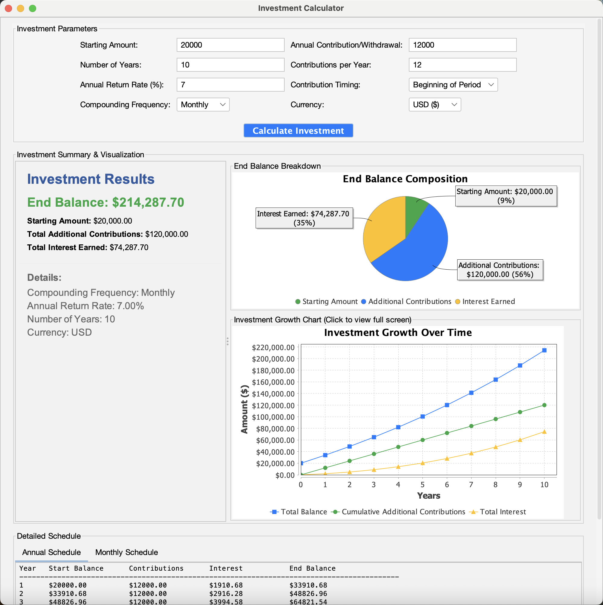
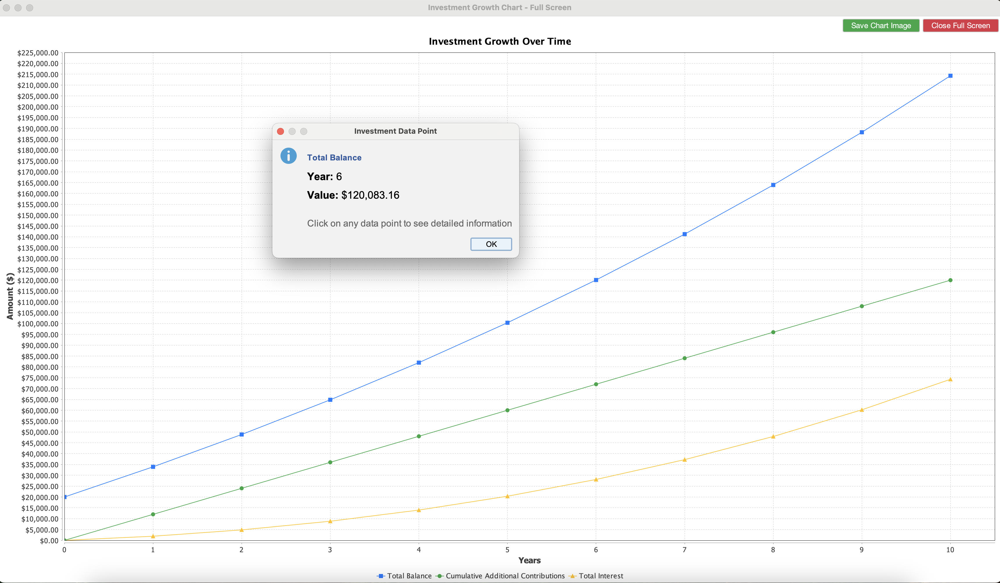

# 💰 Investment Calculator - Advanced Financial Analytics

<div align="center">
  
  
  <h3>📈 Plan your financial future with precision!</h3>
  
  <p>A comprehensive Java Swing application for compound interest calculations with interactive charts, detailed schedules, multi-currency support, and automated testing infrastructure.</p>
  
  [](https://openjdk.org/)
  [](https://docs.oracle.com/javase/tutorial/uiswing/)
  [](https://maven.apache.org/)
  [](https://junit.org/junit5/)
  [](https://github.com/features/actions)
  [](https://www.jfree.org/jfreechart/)
</div>

## 📸 Application Screenshots

<div align="center">
  
  <br>
  <em>Main Application Interface with Investment Parameters and Results</em>
  <br><br>
  
  
  <br>
  <em>Interactive Growth Chart and Investment Breakdown Visualization</em>
</div>

## Features

- **Compound Interest Calculations**: Supports various compounding frequencies (annually, monthly, daily, weekly, quarterly)
- **Periodic Contributions**: Add regular contributions with customizable frequency
- **Negative Contributions**: Support for withdrawals (negative contributions) to model money taken out of investments
- **Visual Growth Chart**: Interactive chart showing investment growth over time
- **Investment Breakdown**: Pie chart showing the composition of final amount (starting amount, contributions, interest earned)
- **Detailed Schedules**: View annual and monthly breakdowns of your investment
- **Modern GUI**: Clean, user-friendly interface with FlatLaf look and feel
- **Comprehensive Results**: Shows end balance, total contributions, and interest earned
- **Automated Testing**: Comprehensive test suite with GitHub Actions CI/CD

## Requirements

- Java 11 or higher
- Maven 3.6 or higher

## Dependencies

- **JFreeChart 1.5.3**: For creating interactive charts and graphs
- **JCommon 1.0.24**: Required dependency for JFreeChart
- **FlatLaf 3.2.5**: Modern look and feel for the GUI
- **JUnit Jupiter 5.9.2**: Testing framework for automated tests

## How to Build and Run

### Using Maven

1. **Clone or download the project**
   ```bash
   cd investment-calculator
   ```

2. **Compile the project**
   ```bash
   mvn clean compile
   ```

3. **Run tests**
   ```bash
   mvn test
   ```

4. **Run the application**
   ```bash
   mvn exec:java -Dexec.mainClass="com.investmentcalc.InvestmentCalculator"
   ```

5. **Create executable JAR**
   ```bash
   mvn clean package
   java -jar target/investment-calculator-1.0.0.jar
   ```

### Direct Java Execution

If you have all dependencies in your classpath:
```bash
javac -cp "lib/*" src/main/java/com/investmentcalc/*.java
java -cp "src/main/java:lib/*" com.investmentcalc.InvestmentCalculator
```

## Testing

The project includes comprehensive automated tests that validate:

- **Simple compound interest calculations** against known mathematical formulas
- **Different compounding frequencies** (daily vs monthly vs annual)
- **Contribution handling** with both positive and negative amounts
- **Edge cases** and precision requirements

### Running Tests

```bash
# Run all tests with detailed output
mvn test

# Run tests with verbose logging
mvn test -X

# Run specific test class
mvn test -Dtest=FinalInvestmentEngineTest
```

Additional useful test commands:

```bash
# Run only the CSV exporter test class
mvn -Dtest=com.investmentcalc.CsvExporterTest test

# Run a single test method
mvn -Dtest=com.investmentcalc.CsvExporterTest#testMonthlyCsvExport test

# Run tests quietly (less console noise)
mvn -q test

# Run tests and print surefire summary (helpful in CI)
mvn -DtrimStackTrace=false test
```
```

### Continuous Integration

The project uses GitHub Actions for automated testing on every push and pull request. See `.github/workflows/test.yml` for the CI configuration.

## Project Structure

```
investment-calculator/
├── .github/
│   └── workflows/
│       └── test.yml                           # GitHub Actions CI/CD configuration
├── docs/
│   ├── images/                               # Application screenshots
│   └── calculation-discrepancies.md         # Calculation methodology documentation
├── src/
│   ├── main/java/com/investmentcalc/
│   │   ├── InvestmentCalculator.java          # Main GUI application
│   │   ├── FinalInvestmentEngine.java         # Core calculation logic
│   │   ├── InvestmentResult.java              # Data class for results
│   │   ├── InvestmentChartPanel.java          # Growth chart visualization
│   │   ├── InvestmentPieChartPanel.java       # Pie chart for investment breakdown
│   │   ├── MonthlyData.java                   # Monthly data structure
│   │   └── YearlyData.java                    # Yearly data structure
│   │   ├── CsvExporter.java                   # CSV export utility (tested)
│   └── test/java/com/investmentcalc/
│       └── FinalInvestmentEngineTest.java     # Comprehensive test suite
│       └── CsvExporterTest.java               # CSV export unit tests
├── pom.xml                                     # Maven configuration
└── README.md                                   # This file
```

## A Note on Calculation Differences

You may notice that different online investment calculators provide slightly different results for the same inputs. This is not usually an error, but a result of different assumptions, especially when contribution frequency (e.g., monthly) does not match the compounding frequency (e.g., annually).

Calculators must decide when the contributions start earning interest. Common models include:

- **Beginning of Period**: Contributions earn interest for the full compounding period.
- **End of Period**: Contributions only start earning interest in the next period.
- **Average Contribution**: A hybrid model that approximates the effect of contributions made throughout the period.

This calculator uses a **Beginning of Period** model when "Beginning of Period" is selected, and **End of Period** when "End of Period" is selected in the contribution timing dropdown.

For a detailed breakdown of these models and why discrepancies appear, please see the [Calculation Discrepancies Documentation](docs/calculation-discrepancies.md).

## Technical Details

- **Compound Interest Formula**: Uses the standard compound interest formula with periodic contributions
- **Precision**: Uses BigDecimal with 10 decimal places for financial calculations to avoid floating-point errors
- **Charting**: JFreeChart provides interactive zooming and tooltips
- **GUI Framework**: Swing with modern FlatLaf styling
- **Architecture**: Clean separation between calculation logic and presentation layer
- **Testing**: JUnit 5 with comprehensive test coverage including edge cases

Additional technical notes:

- **CSV export**: `CsvExporter` centralizes CSV output for both monthly and annual schedules. It writes UTF-8 CSV using Locale.US numeric formatting and rounds values to two decimals (RoundingMode.HALF_UP). The UI (`InvestmentCalculator`) delegates CSV file creation to this utility so the same logic is testable and reusable.
- **Tests**: Unit tests for CSV export (`CsvExporterTest`) use JUnit 5's `@TempDir` to create temporary files and assert exact CSV headers and numeric values. The test output is intentionally verbose (prints a small summary and `Result:   ✅ PASS`) to match the project's existing test-style reporting used in CI logs.
- **Future improvements**: Background CSV export via SwingWorker (to avoid blocking the EDT), locale-aware formatting options, and optional currency columns for exported files.

## Customization

You can easily modify the application by:
- Changing the default values in the input fields
- Adding new compounding frequencies in the engine
- Customizing chart colors and styles in the chart panel classes
- Modifying the GUI layout in InvestmentCalculator.java
- Adding new test cases in the test suite

## Contributing

1. Fork the repository
2. Create a feature branch
3. Add tests for new functionality
4. Ensure all tests pass: `mvn test`
5. Submit a pull request

The GitHub Actions workflow will automatically run tests on your pull request.

## License

This project is open source and available under the MIT License.
